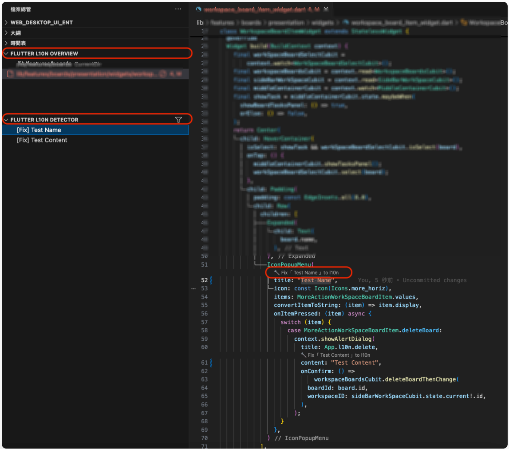

# Flutter L10n 助手 (Flutter L10n Detector)

## 核心功能

* 簡化 Flutter 的 (l10n) 工作流程您**偵測**並 **重構**專案中的字串


### 1. 專案全域掃描 (Flutter L10n Overview)

* **全專案字串偵測**：提供一個側邊欄視圖，掃描您的 `lib` 資料夾，列出所有包含硬編碼 (hardcoded) 字串的 Dart 檔案。
* **自訂掃描範圍**：
    * **過濾目錄 (`dartL10n.filterDir`)**：可讓您將掃描範圍縮小到特定的子目錄（例如 `lib/features/profile`），專注於單一功能。
    * **忽略檔案/目錄 (`dartL10n.ignoreFile`)**：可從掃描清單中暫時或永久移除特定檔案或整個資料夾。
* **一鍵跳轉**：點擊清單中的檔案，會自動開啟並跳轉到該字串所在的位置。

### 2. 字串重構 (Quick Fix)

* **CodeLens 快速修復**：在偵測到的字串上方顯示 `🔧 Fix「...」to l10n` 按鈕，點擊即可開始重構。
* **Code Action 支援**：也可選取字串（包含引號），使用快捷鍵 (`Ctrl` + `.`) 呼叫 `🌐 Export String to l10n resource`。
* **鍵值建議**：自動偵測字串所在的**類別 (Class)** 或**檔案名稱**，並將其轉換為 snake_case 格式（例如 `my_widget_title`）作為建議的 l10n 鍵值。
* **參數自動偵測**：
    * 能自動識別字串中的變數（例如 `"Hello $name"` 或 `"Total: ${count}"`）。
    * 若偵測到參數，會彈出選單讓您選擇參數類型（`String` 或 `num`）。
    * 自動在 `.arb` 檔案中生成對應的 `placeholders` 區塊。
* **自動程式碼替換**：
    * 將 `"My String"` 替換為 `context.l10n.my_string`。
    * 將 `"Hello $name"` 替換為 `context.l10n.hello_name(name)`。
* **`context.l10n` 輔助程式**：
    * 自動檢查並生成 `localization_extension.dart` 檔案，讓您能方便地使用 `context.l10n` getter。
    * 自動在 Dart 檔案頂部添加所需的 import 語句。

### 3. `.arb` 檔案自動管理

* **儲存時自動排序**：當您儲存 `.arb` 檔案時，擴充功能會自動驗證 JSON 格式，並依特定規則排序：
    1.  `appName` (如果存在)
    2.  其他沒有 `@` 對應的一般鍵值 (按字母排序)
    3.  成對的 `key` 與 `@key` (按字母排序)
* **自動執行 `flutter gen-l10n`**：
    * 當您透過重構加入新的 l10n 鍵值時。
    * 當您手動儲存 `.arb` 檔案時。
    * 擴充功能會自動在終端機執行 `flutter gen-l10n`，確保您的 `AppLocalizations.dart` 始終保持最新。

### 4. 當前檔案分析 (Flutter L10n Detector)

* **即時分析視圖**：提供另一個側邊欄視圖，專注於**當前開啟**的 Dart 檔案。
* **字串分類標籤**：將當前檔案中的字串分類為：
    * `[Fix]`：建議進行 l10n 重構的字串。
    * `[Log]`：`log(...)` 或 `Logger(...)` 中的字串。
    * `[Print]`：`print(...)` 中的字串。
    * `[Other]`：被識別為常數、路由路徑 (`/`)、`Key()` 或 `DateFormat()` 的字串。
* **標籤過濾**：您可以在此視圖中快速過濾，例如只顯示 `[Fix]` 標籤的字串。

## 如何使用 (建議工作流程)

1.  在 VS Code 側邊欄打開「**Flutter L10n Overview**」視圖。
2.  點擊右上角的「Refresh」圖示 (`dartL10n.refresh`) 掃描您的專案。
3.  視圖中會列出所有包含硬編碼字串的檔案。
4.  點擊任一檔案，編輯器將開啟並跳轉到該字串。
5.  點擊字串上方的 `🔧 Fix to l10n` CodeLens，或選取字串後按 `Ctrl + .`。
6.  選擇 `🌐 Export String to l10n resource`。
7.  從建議清單中選擇一個鍵值前綴（例如 `[Class] MyWidget` 或 `[File] my_widget`），或選擇自訂輸入。
8.  在輸入框中確認最終的 l10n 鍵值 (例如 `my_widget_title`)。
9.  如果偵測到參數 (如 `$name`)，請為其選擇類型 (`String` / `num`)。
10. **完成！** 擴充功能將會：
    * 自動更新 `lib/l10n/` 目錄下的所有 `.arb` 檔案。
    * 自動排序 `.arb` 檔案內容。
    * 將您的 Dart 程式碼替換為 `context.l10n.my_widget_title`。
    * 自動添加 `localization_extension.dart` 的 import。
    * 在背景執行 `flutter gen-l10n`。

## 擴充功能設定 (Configuration)

您可以在 `.vscode/settings.json` 中自訂以下設定：

* l10m.yaml
```yaml
arb-dir: lib/l10n/
template-arb-file: app_en.arb
output-localization-file: app_localizations.dart
untranslated-messages-file: untranslated_messages.txt
output-dir: lib/l10n/gen
```

```json
{
  "flutter-l10n-detector.localizations": {
    "className": "AppLocalizations", // 您的 AppLocalizations 類別名稱
    "localizationsPath":  "lib/l10n/gen", // AppLocalizations 的 import 路徑
    "outputPath": "lib/l10n/gen" // context.l10n 輔助檔案的生成路徑
  }
}
```
